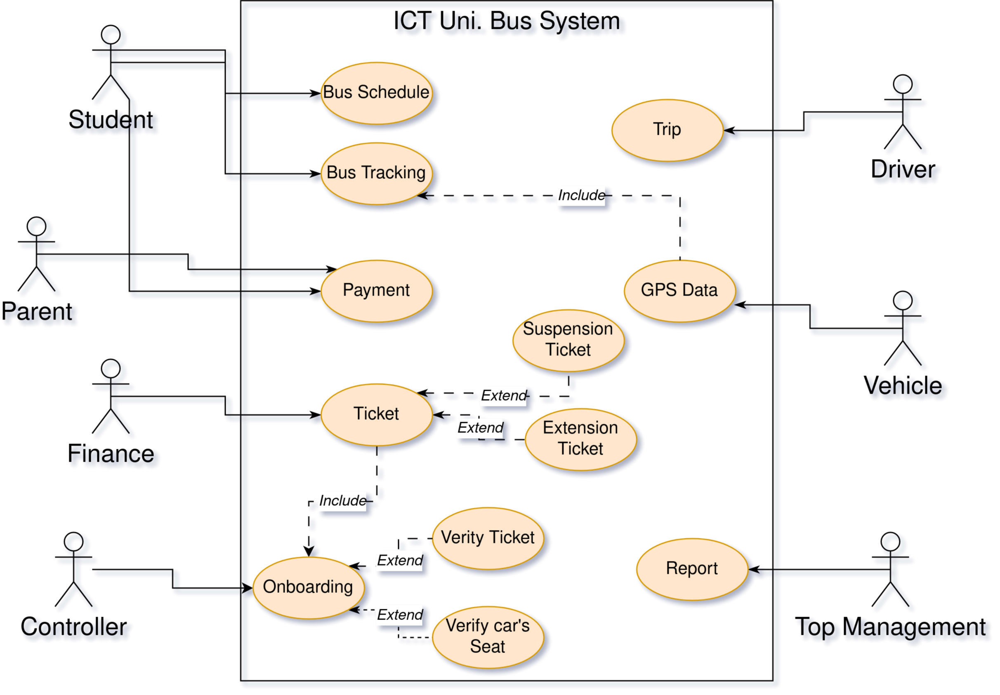

# [Final Exam] Software Design & Modeling (SE 3140)

## Author

---

`Steve Djumo Kouekam -- ICTU 2022 27 55` \
`Computer Science -- ICT University (Fall 22)`

---

## Answers

### **1. Give the stakeholders you will meet to gather requirements for project. (Justify your choice or identification)**

System's stakeholders :

* **Parents**: Since they are responsible for the payment and do so to enable the student to succeed, the new service should intrigue and satisfy the parents.
* **Students**: They will be the primary user of the bus. Since a product quality depend on their customer satisfaction, it is then paramount that the bus service solve all the student's pain point, otherwise they will look for another alternative and that outcome will negatively impact the finance and longevity of the bus project.
* **Drivers**: As the secondary user of the system and the stakeholder that will interact the most with the new system, it is essential that the said system not only work flawlessly but also empower the driver. As such positive impression by the driver is one target. Furthermore, being the stakeholder interacting the most with the system, he is, as well, an inestimable source of feedback so as to improve the service.
* **Controller**: As both the security expert and ticket collector, his advice is invaluable to increase student security and onboarding process.
* **ICT University - Finance Department**: Responsible for the payment process, his/her feedback is instrumental to ameliorate the interaction with students and parents alike.
* **ICT University - Top Management**: They responsible for management decision need to make the system succeed in order to raise the school prestige, make additional buck, or participate to student success. The report provided to them may make the decision taker go for better marketing, an increase in spending so as to purchase better tools and vehicle, and so on.

**_Note_ :** _IT Technician is amount the stakeholder since the app is expected to run environment where there is not a tech. literate person. In case of major trouble, the developer should provide support to client/stakeholder._

### **2. For each stakeholder, give the technique of gathering of information you will use and justify your choice of technique**

* **Parents**: We use **survey**. Since they are busy person and interviewing them one after the other is expensive for both the parents and the interviewer, a *questionaire* is lucky alternative.
* **Students**: We make a **One to One interview**. As all students are gathered in on place, interviewing them is much simpler. Furthermore, although One on One interivew is slower than group interview, this approach has the advantage to draw out the unfiltered opinion of the student without him/her succumbing to peer pressure.
* **Drivers**: We use **Focused Groups**. Interviewing all the drivers at once have the benifits of making all of them to thinking really hard for their answers. Indeed, it allows driver to ponder and brainstorm on a particular topic. Furthermore this approach work here since drivers will take this exercise simply as part of their job, contrary to students who will not even bother to show up for the most parts besides not taking the interaction seriously.
* **Finance Department**: We use **Focused Group**. For all the reasons cited above, we apply the same technic.
* **Top Management**: We use **Focused Group**. For all the reason cited above, we apply the same principle.

### **3.1 Model and design the UML use case diagram of your solution**

### **3.2 Write the use case description of the use case above**

* **Use Case Name**: GPS Data
* **Description**: The vehicle send geo-localization data so that other actors can track it.
* **Actor**: Vehicle
* **Pre-condition**: Trip Started but not ended, Access to Internet
* **Post-condition**: GPS data saved to server database
* **Basic Flow**:
  * Step 1: The vehicle authenticate itself to the server
  * Step 2: The server retrieve its GPS data (from Satellite or third party geo-localization server)
  * Step 3: Upon retrieval, the vehicle send the GPS Data to server for recording
* **Alternative flow (Step1)**: The vehicle send error message to specialized server, and the driver is notified of the issue
* **Alternate flow (Step 2)**: The vehicle notify all interested parties of the issue (students, administration, driver, controller).
* **Alternate flow (Step 2)**: The vehicle restart at step 1. If the issue continuously occur, the interested parties are notified (driver, controller, finance, administration).

### **3.3 Design the UML Activity diagram of your solution**

### **3.4 Design the UML class diagram of your solution**
