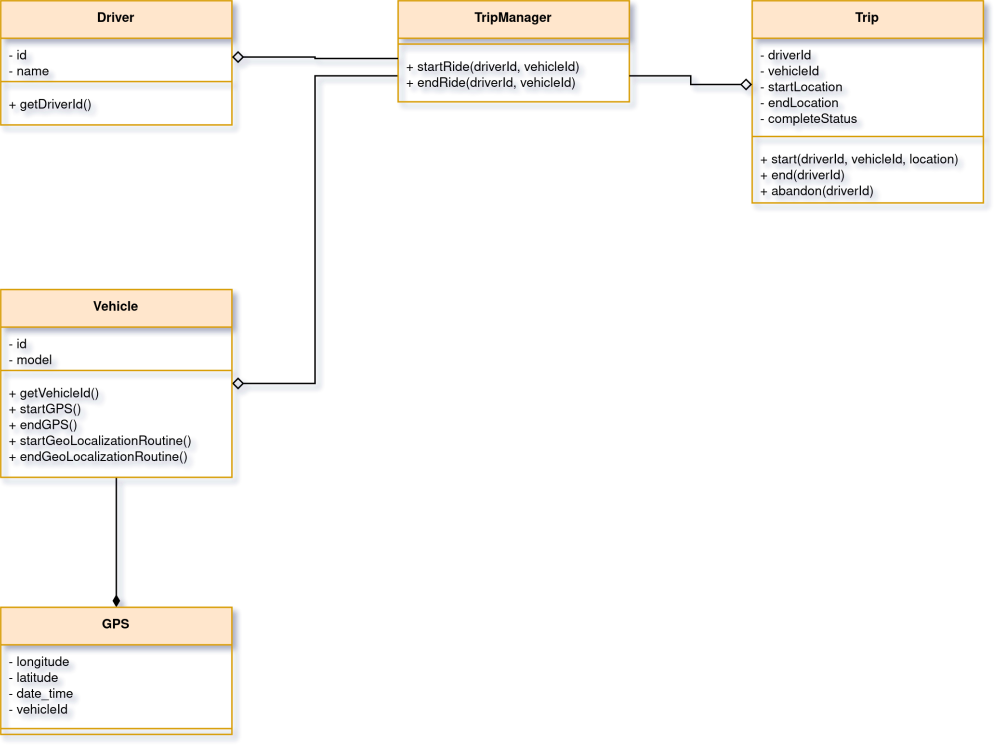
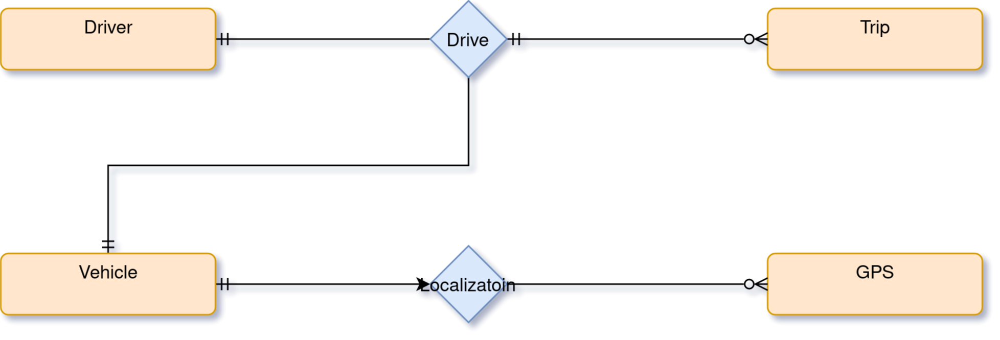

# [CA Exam] Intro. Mobile Development (CS 3410)

## Author

`Steve Djumo Kouekam -- ICTU 2022 27 55` \
`Computer Science -- ICT University (Fall 22)` \
`670 73 96 44 --- djumokouekam.steve@ictuniversity.edu.cm`

## Table Of Contents

## Project's Architecture

At first, the **MVP pattern** was a consideration, however after much thinking, the project followed a **MVC pattern** instead. The main issue with the former pattern is that it was time consuming to properly implement since it would have required many *Presenter* for each *View*.

Furthermore, **MVC pattern** is extremely flexible, so if some code change further down the line, this architecture can easily adapt to the new requirements.

## Class Diagrams

## E-R Diagrams

## Repository

The full source code with the install instruction is available on the [project github page](https://github.com/yayolande/logbook-app)
