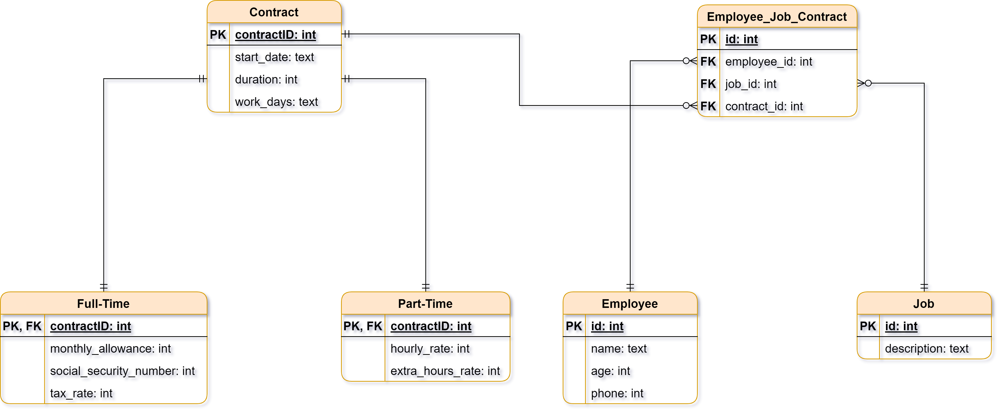
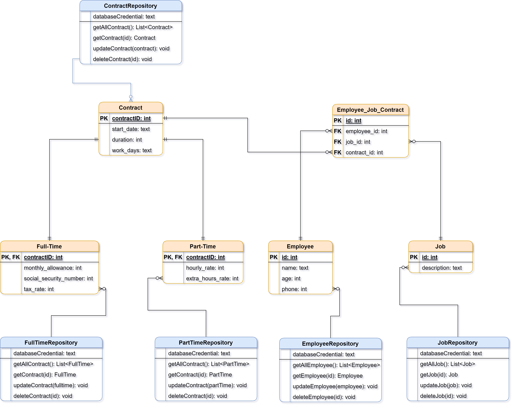

# [Final Exam] Intro. Mobile Development (CS 3410)

## Author

`Steve Djumo Kouekam -- ICTU 2022 27 55` \
`Computer Science -- ICT University (Fall 22)`

## Section A

### 1. Name and describe the main components of modern applications architecture and for each of component describe it’s role

Modern Applications come many shapes and sizes. However, of the most popular architecture for modern mobile application is the **MVC** style architecture.

**Model-View-Controller**, or **MVC** for short, is a software architecture pattern commonly used for application involving a *User Interface* to properly structure a project. Its main components are :

* **Controller**: It is the only entry point for all **users requests/inputs**. All request received from the *User* or the *View* is processed in the *Controller*, as it act as the control flow of the application. Once the request intention have been analyzed, the controller delegate further business processing the *Model*. At the end of all the business processing, the required data are sent to the *View* or back to the *users*. As you can see it act as the **middle man** between the *View* and the *Model*.
* **View**: Its job is to either display data to the user or to build the UI that will be sent back by the *Controller* to the User. The *View* only receive input data from the *Controller*, and similarly, it only send/output data or event to the same *Controller*.
* **Model**: It is the module responsible for the core logic of the application. It is this layer that in charge of saving and retrieving data from database, processing business data and user data.

### 2. One of the components you described above is responsible for providing access to database through an API. Name and describe the 03 models used in database design then tell us which of these models the figure presented above corresponds to

In database design, 3 models are used:
<!-- Not completed yet -->

* **Conceptual Data Model**: This the most bare-bones model, being the business description of the database. It is represent only using *Entity* and *Relationship* between the *Entity*. It is the most abstract we can get with Entity-Relationship Modeling, and is database independent.
* **Logical Data Model**: It is the implementation of the *Conceptual Data Model* for a specific use case, with a few more details concerning the attributes, the primary & foreign keys. Furthermore, it is database independent as well.
* **Physical Data Model**: This model is the most low-level and database dependent. They exist many programs that can translate this model to the appropriate DBMS code.
  
The model used in the diagram above is the **Logical Model** for the reasons cited as follow :

* **Reason 1**: By proceeding by elimination, this diagram cannot be a *Conceptual Data Model*. Because, *Conceptual Model* only use *entity* and *relationship*. The point is to make it easier to communicate with non-technical people. However, this design have more details, so it is no more high level anymore.
* **Reason 2**: Similarly, this diagram cannot be a *Physical Model*. Since *Physical Model* are low-level and database dependent, so we could infer that if our database model contains details that could hint us toward a certain type of DBMS, then we could positively conclude. However on the provided diagram, nowhere we see details that precisely pull us toward a database (no DBMS optimization trick, no special element peculiar to a singular DBMs). From those evidences, we can conjecture that the model used on the above diagram is not a *Physical Model*.

### 3. Exploit the figure presented above to produce the diagram of the logical model of this database. Explain which rules were applied to produce the foreign keys and the relational tables expected in your logical model

To make this database logical model, I did a **database normalization (2NF)**.

***Note*** *: Since inheritance is not allowed in DB design, I used some trick to get rid of it.

### 4. The API you are required to build should provide basic CRUD (Create, Read, Update, Delete) service through some special classes that would bring those methods. Complete your logical diagram by adding the specific classes that would provide CRUD service for each of your relational table. Make sure each API class you add is described with it’s CRUD methods in the diagram

## Section B
