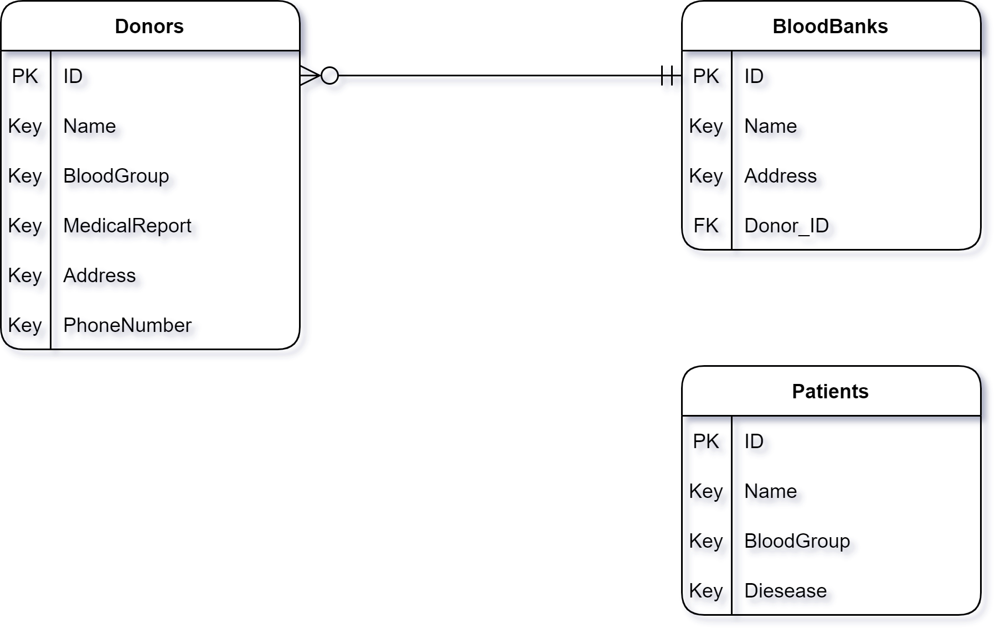
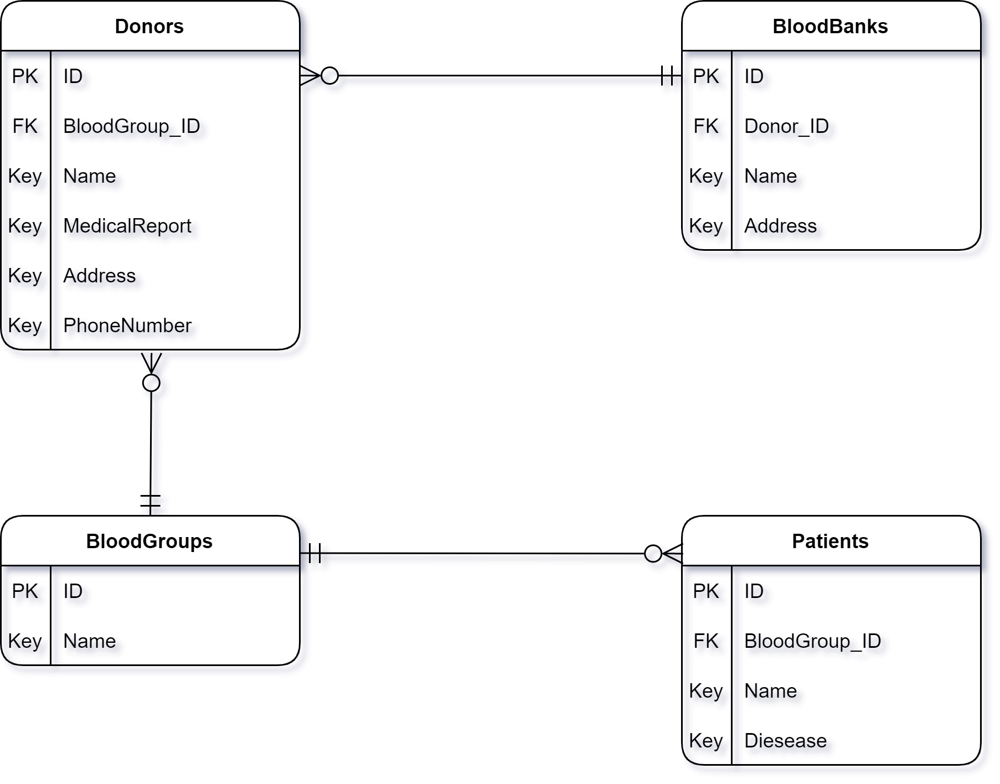

# [CA] Relational Database -- Group 2

## 1) Design an Entity-Relationship (E-R) diagram, and then attempt normalizing it

From the requirement, we have the following ER Diagram :



However, this database can be further improved. By following the normalization process, we beget the following diagram :



## 2) Relational Database Schema

From the normalized *ER Diagram*, we get the following schema :

* `BloodGroups (id, name)`
* `Patients (id, bloodGroup_id, name, disease)`
* `Donors (id, bloodGroup_id, name, medicalReport, address, phone)`
* `BloodBanks (id, donor_id, name, address)`

## 3) Implement the database with MySQL

***NB :*** *This SQL code is also available on the filesystem at `./assets/`.*

Below is the **SQL code** to create the desired database :

```SQL
CREATE DATABASE IF NOT EXISTS `Blood_Donations`;
USE `Blood_Donations`;


CREATE TABLE IF NOT EXISTS `Bloodtypes` (
  `id` int NOT NULL AUTO_INCREMENT,
  `name` varchar(255) NOT NULL,
  PRIMARY KEY (`id`),
  UNIQUE (`name`)
);

CREATE TABLE IF NOT EXISTS `Patients` (
  `id` int NOT NULL AUTO_INCREMENT ,
  `name` varchar(255) NOT NULL,
  `disease` varchar(255) NOT NULL,
  `bloodType_id` int NOT NULL,
  PRIMARY key (`id`),
  FOREIGN KEY (`bloodType_id`) REFERENCES `Bloodtypes` (`id`)
);

CREATE TABLE IF NOT EXISTS `Donors` (
  `id` int NOT NULL AUTO_INCREMENT ,
  `name` varchar(255) NOT NULL,
  `medicalReport` varchar(255) NOT NULL,
  `bloodType_id` int NOT NULL,
  `address` varchar(255) NOT NULL,
  `phone` varchar(20) NOT NULL,
  PRIMARY key (`id`),
  FOREIGN KEY (`bloodType_id`) REFERENCES `Bloodtypes` (`id`)
);

CREATE TABLE IF NOT EXISTS `BloodBanks` (
  `id` int NOT NULL AUTO_INCREMENT ,
  `name` varchar(255) NOT NULL,
  `donor_id` int NOT NULL,
  `address` varchar(255) NOT NULL,
  `phone` varchar(20) NOT NULL,
  PRIMARY key (`id`),
  FOREIGN KEY (`donor_id`) REFERENCES `Donors` (`id`)
);
```

## 4) Populate you database to execute some SQL request test

***NB :*** *This SQL code is also available on the filesystem at `./assets/`.*

First, let's populate the database :

```SQL
INSERT INTO `Bloodtypes` (`name`) VALUES
  ('A+'),
  ('B+'),
  ('O+'),
  ('AB+'),
  ('A-'),
  ('B-'),
  ('O-'),
  ('AB-');

INSERT INTO Patients (`name`, `disease`, `bloodType_id`) VALUES   
  ('Steve Djumo', 'Diabete', 2),
  ('Patrick Malcn', 'Heart Attack', 5),
  ('Walker Amstrong', 'Bacteria Infection', 1),
  ('Walker Juliana', 'Blood Loss', 1),
  ('Esteban Caliente', 'Slow Heart Beat', 2),
  ('Oneil Abraham', 'Skin Infection', 4),
  ('Marco Rubio', 'Pancreate failure', 1),
  ('Kaptio Melinda', 'Blood Loss', 3),
  ('Tengua Armel', 'Heart Attack', 2);

INSERT INTO Donors (`name`, `medicalReport`, `bloodType_id`, address, phone) VALUES   
  ('Bandit Moscow', 'Heart donation at death', 2, 'Yaounde - Cameroon', '154 785 255'),
  ('Melinda Arteta', 'Lumph donation at death', 5, 'Roma - Italy', '235 152 456'),
  ('Mazari Matetzi', 'Brain donation at death', 2, 'Venice - Italy', '945 185 052'),
  ('Mikami Mikado', 'Blood, Heart donation', 2, 'Tokyo - Japan', '854 085 904'),
  ('Bill Beker', 'Blood, Heart donation', 2, 'Atlanta - USA', '987 543 6124');

INSERT INTO BloodBanks (`name`, `donor_id`, `address`) VALUES   
  ('Research For Cancer', 2, 'Florida - USA'),
  ('Child Care Donation', 5, 'Berlin - Germany'),
  ('Charity Donors for Health', 1, 'Moscow - Russia'),
  ('Organ Donation Center', 5, 'Adis Ababa - Ethiopia'),
  ('High Risk Research Club', 3, 'Toronto - Canada'),
  ('Health Matzaza', 4, 'Madrid - Spain');
```

Now let's do some *SQL request* to test our design :

```SQL
-- List all patients
SELECT * FROM `Patients`;

-- List all patients and their blood type
SELECT P.id, P.name, P.disease, P.bloodType_id, B.name AS bloodTypeName FROM `Patients` P LEFT JOIN `Bloodtypes` B ON P.bloodType_id = B.id;

-- List of all patients having a blood type containing the letter "A"
SELECT P.id, P.name, P.disease, P.bloodType_id, B.name AS bloodTypeName FROM `Patients` P LEFT JOIN `Bloodtypes` B ON P.bloodType_id = B.id WHERE B.name like '%A%';
```
