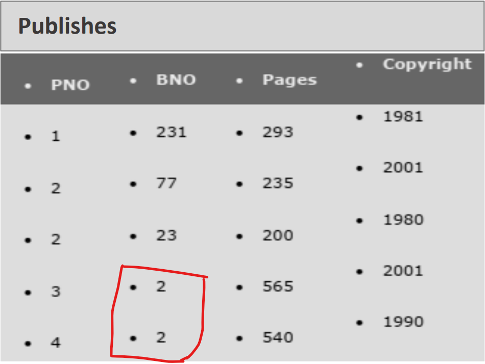
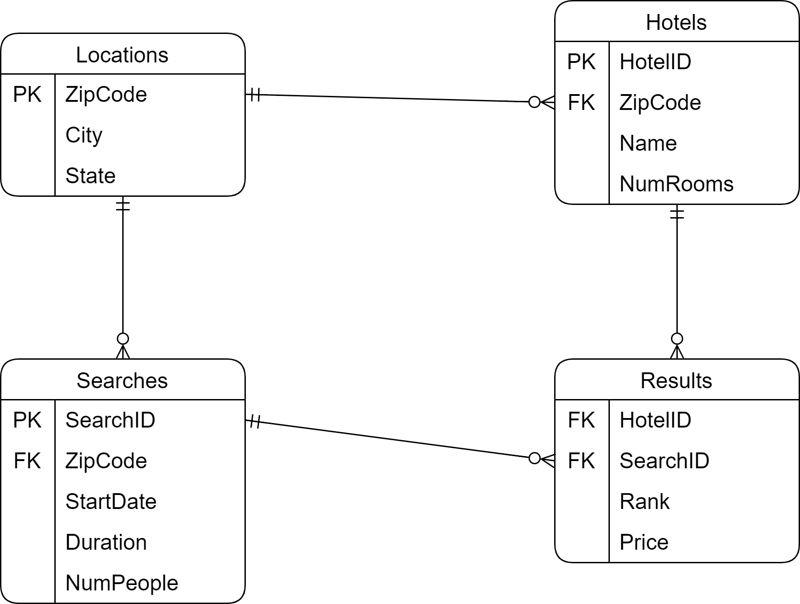
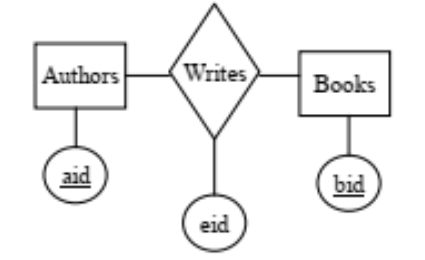

# [Final Exam] Relational Database & Web Integration (SE 3102)

## Author

`Steve Djumo Kouekam -- ICTU 2022 27 55` \
`Computer Science - ICT University`

---

## Section A

### Question 1

1. Does this database schema allow for a book to have more than one
publisher? Explain why or why not using an example.

**Yes**, the database allow for redundant book for a different publisher. As a proof, have a look to the database table **Publishes** below.



As you can see, the 2 last record have the same book (*bno = 2*) with different publisher (*pno = 3 & pno = 4*).

2. Does this database schema allow for a book to be currently out of
print (not currently being published)? Explain why or why not using
an example

**No**, this database doesn't allow for a book to be out of printer. If we need to achieve that outcome at all cost, then we should remove the concerned row into **Publishes** table.
However, that action will have the undesirable effect of removing a book publication all together.
Thus to reach our target, we should re-design the database so as to include the inventory for every published book.

3. List three super keys of the books relation

* **{BNO}**
* **{BNO, Title}**
* **{BNO, Author}**

4. What is the relational schema for this database? Use the proper
notation for specifying a schema

* **Books** (<u>BNO</u>, title, author, date, edition)
* **Publishers** (<u>PNO</u>, publisher, city, web_site)
* **Publishes** (<u>PNO</u>, <u>BNO</u>, pages, copyright)

5. Write a SQL expression that computes the set intersection of the date and copyright attribute

```SQL
SELECT B.date, P.copyright FROM `Publishes` P LEFT JOIN Books B ON B.BNO = P.BNO;
```

6. Write an SQL statement that lists all books that have the same title
but different authors

```SQL
SELECT * FROM Books B, Books C WHERE B.title = C.title AND B.author != C.author;
```

### Question 2

1. Convert this database schema into an E/R database Model



2. Explain presence of the table Results

The role of the **Results** table is to cache previous user search so as to to quickly retrieve data from Database when similar search query is made.

3. Write a SQL query that creates each table

```SQL
CREATE TABLE Locations (
  zipCode INTEGER AUTO_INCREMENT,
  city TEXT NOT NULL,
  state TEXT NOT NULL,
  PRIMARY key (zipCode)
);

CREATE TABLE Hotels (
  hotelID INTEGER AUTO_INCREMENT,
  zipCode INTEGER NOT NULL,
  name varchar(255) NOT NULL,
  numRooms INTEGER NOT NULL,
  PRIMARY key (hotelID),
  FOREIGN KEY (zipCode) REFERENCES Locations (zipCode)
);

CREATE TABLE Searches (
  searchID INTEGER AUTO_INCREMENT,
  zipCode INTEGER NOT NULL,
  startDate varchar(255) NOT NULL,
  duration DOUBLE NOT NULL,
  numPeople INTEGER NOT NULL,
  PRIMARY key (searchID),
  FOREIGN KEY (zipCode) REFERENCES Locations (zipCode)
);

CREATE TABLE Results (
  hotelID INTEGER AUTO_INCREMENT,
  searchID INTEGER NOT NULL,
  searchRank INTEGER NOT NULL,
  price INTEGER NOT NULL,
  FOREIGN KEY (hotelID) REFERENCES Hotels (hotelID),
  FOREIGN KEY (searchID) REFERENCES Searches (searchID)
);
```

4. Write a single SQL query (it should be one statement) to answer the complex query

## Section B

### Question 4

1. Assume

* **a) maximal number of triples that R contains** : 300
* **b) minimal number of triples that R contains** : 300

2. Store information

* **a) which of the two diagrams presented are more suitable for modeling the information? Can the information be captured in both diagrams? Explain** : The **first diagram** capture the information since the tuple can be represented with this schema. The **second diagram** equally capture the information and is the most basic and simplest ER Diagram. However, I have to award the most suitable for storing our captured information to the **second diagram** since its cardinality constraints is most flexible to change.
* **b) Can you add edge constraints (arrows) to the diagram on the left in order to capture this information? What about the diagram on right? Explain** : No, the **first diagram** cannot be accurate if we change the edge since, although the *editor* edit at most one book, the *author* as well is forced write only at most one book, which is not the researched effect. On the contrary, the **second diagram** have no issue in this new adjustment since the modified edge only affect the *editor*.

3. What is wrong with using the following diagram to model the information



With this new diagram, each book written by an author can only be edited by **one and only one editor**

### Question 3

1. Problem the designer was trying to solve

From the SQL Code, we can infer that the designer wanted to create 3 relational tables. The first 2 tables (*SF, CF*) define a student table and a course table from a faculty (university's element). Finally, the 3rd table role is to present all students enrolled in specific course.

2. Problem remaining in the SQL code

```SQL
Create table SF(
 studentId char(4),
 Faculty Varchar(50),
 Primary key (StudentId),
 UNIQUE (studentId, Faculty)
 ;
Create table CF (
 CourseId Char(4),
 Faculty Varchar(50),
 Primary key (CourseId, Faculty);
 UNIQUE (CourseId, Faculty)
 ;
Create table SCF (
 StudentId char (4),
 CourseId Char(4),
 Faculty Varchar(50),
 Primary key (StudentId, CourseId),
 FOREIGN KEY (StudentId, Faculty) REFERENCES SF (StudentId, Faculty),
 FOREIGN KEY (CourseId, Faculty) REFERENCES CF (CourseId, Faculty)
 ;
```

After some formating, we get the code above. From this we can clearly see that the issue is that **there are missing closing parenthesis for the `CREATE TABLE` statement.** Furthermore `Primary key (CourseId, Faculty);` from `Create table CF` terminate with a **semicolong `;` instead of a comma `,`**. \
The final program look like below

```SQL
Create table SF(
 studentId char(4),
 Faculty Varchar(50),
 Primary key (StudentId),
 UNIQUE (studentId, Faculty)
 );
Create table CF (
 CourseId Char(4),
 Faculty Varchar(50),
 Primary key (CourseId, Faculty),
 UNIQUE (CourseId, Faculty)
 );
Create table SCF (
 StudentId char (4),
 CourseId Char(4),
 Faculty Varchar(50),
 Primary key (StudentId, CourseId),
 FOREIGN KEY (StudentId, Faculty) REFERENCES SF (StudentId, Faculty),
 FOREIGN KEY (CourseId, Faculty) REFERENCES CF (CourseId, Faculty)
 );
```

3. Describe and comment on a particular features of SQL that make this solution Possible

**Data Definition Language (DDL)** contains the `CREATE TABLE` command and all the constraints needed to define the database.
