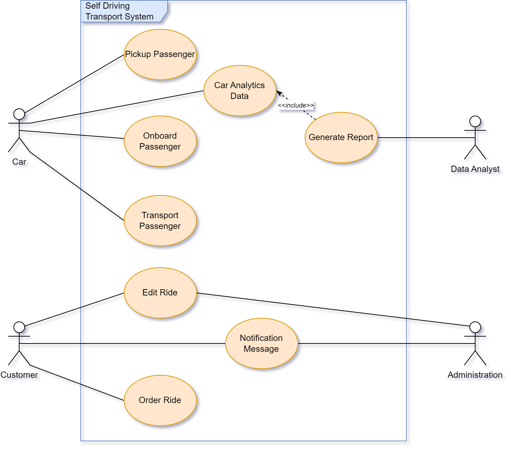
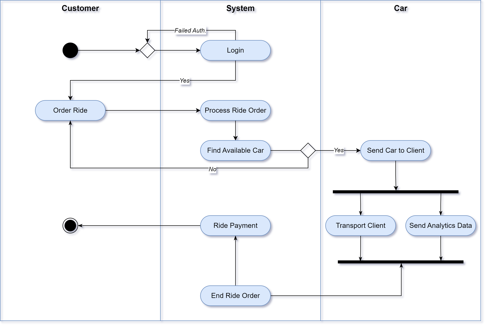

# [CA Part 2] Case Study AutoCab - Self Drive Taxi Company

## 1) Draw Use Case Diagram

The following diagram have been made with [draw.io](https://app.diagrams.net)

There are 4 actors for the system, from which the *customer* and the *self driving vehicle* are the most important. The customer mostly order a *ride*, while the vehicle is in charge of moving the passenger from point A to B.

## 2) Draw Activity Diagram

The following diagram have been made with [draw.io](https://app.diagrams.net)

After the customer authenticate, he send his ride order to the system. The system then initiate all necessary actions (such as rider order recording, credit card verification, etc) to start a ride. Then the system look for an available vehicle that could best handle the requested ride. If a error occur between those 2 processes, an error message is sent to the user and the system request a new *ride order* from the client. Otherwise, all relevant data are sent to the self driven vehicle for it to transport the passenger/client. While in traffic, the vehicle periodically send data and metadata to the system server, for latter processing by the analytic team.

## Author

Steve Djumo Kouekam -- ICTU 2022 27 55
