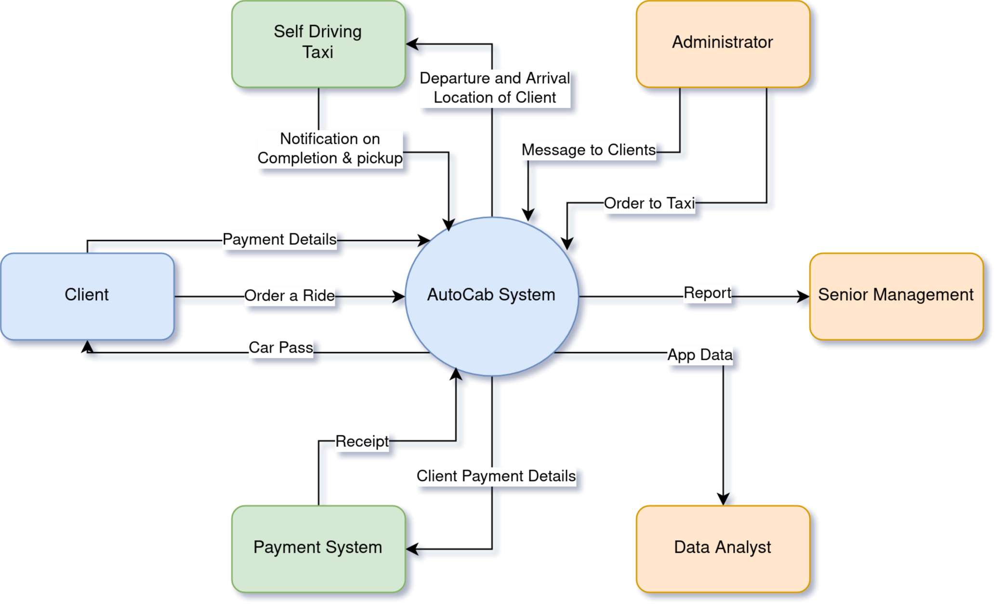
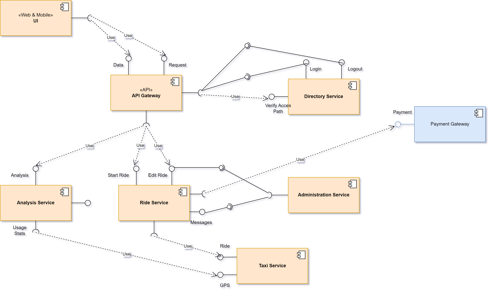
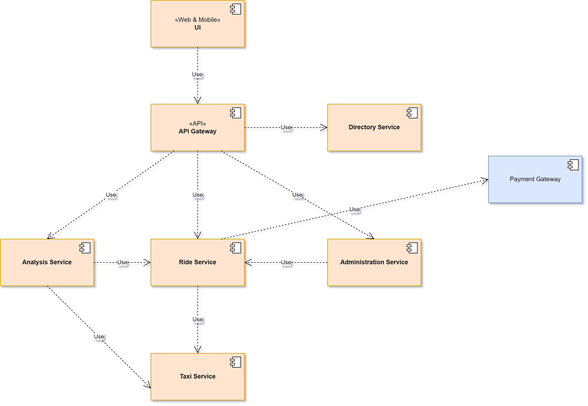
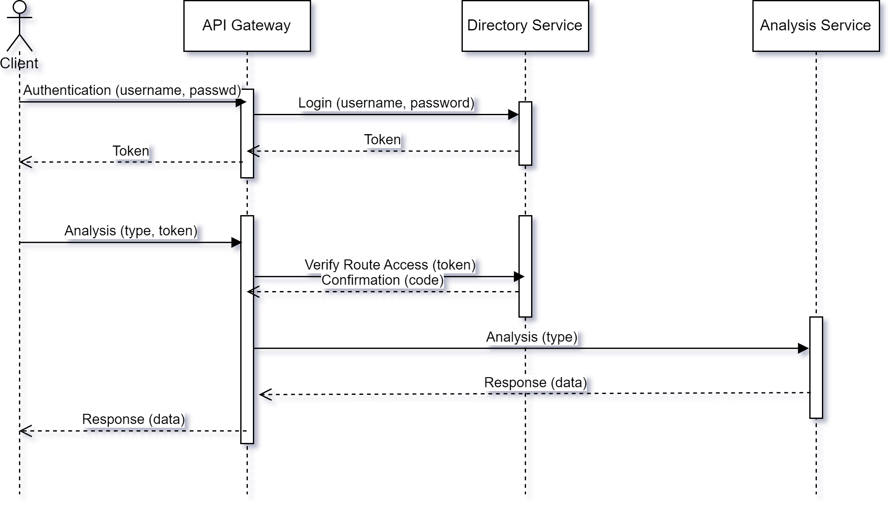

# [CA Software Architecture] Case Study AutoCab - Self Drive Taxi Company

## Questions

Case Study A: AutoCab - A self Drive Taxi Company

### 1) 4 Qualities attributes and Justifications

1) 4 Qualities attributes and Justifications :
The current standard for software quality characteristics is [ISO/IEC 25010:2011](https://www.iso.org/standard/35733.html).
Although that standard have 8 software quality characteristics, only 3 seems to be of interest : *Reliability, Security, and Maintainability*. From this and the requirements, we can infer 4 quality attributes :

* [**Availability**](https://en.wikipedia.org/wiki/Availability): Since the *AutoCab* is expected to be up `24/7`, then the probability that the system is working at any moment must be close to 1. Thus, the amount of time is the system is uptime should be far greater than the downtime time.
* **Reliability**: Due to the complexity of self-driving car technology, and the amount of expected user the system must handle, it is not crazy to say that the system will inevitably be down or fails. In that case, what matter is whether or not the system is able to recover, and how fast it does (which nicely tie back to availability attributes). Additionally, this software quality characteristic/attribute is essential since in case of failure, the company car may cause materials and human losses. Therefore, the ability of the system to operate normally despite hardware and software issues is paramount.
* **Testability**: A few years ago *Test Driven Development (TDD)* have taken the world by storm. With this development method every piece of the system is tested thoroughly. Since a self-driving car failure may be fatal to the customer, thus, before the system hit the market, all bugs and errors must be detected in advance so that they can be fixed in house. Therefore, to keep the customer trust and avoid nasty lawsuit, the system must go through an intense battery of test before going to production. As such, the system components should be easy to test.
* **Maintainability**: The system should be easy to maintain, to correct defects or to change in the future. This aspect is essential since this quality make correcting bugs found in development and in production easy and quick to correct, which will increase customer satisfaction. Furthermore, a maintainable system seamlessly allow addition of new features, thus facilitating the rapid growth of the system.
* **Security**: As transaction need to be secure and audited, the system must provide a high [integrity](https://syndicode.com/blog/12-software-architecture-quality-attributes/) level so as to prevent unauthorized access to the system or its data.

### 2) Rank Autocab's quality attributes from the users perspective

From Software Architecture class by Dams. Gabriel, for Customer perspective `Usability > Security`. Ergo, we have the following ranking :

1. **Availability** : client want to order a ride at any moment.
1. **Reliability** : client want to reach destination safely whatever the obstacle.
1. **Maintainability** : client appreciate that there bugs report is swiftly solved.
1. **Security** : client want their data to be secure and the system to be safe.

### 3) Architecture Type to recommend for implementing the above system

Looking back at the system requirement, I will recommend the **Microservices Architecture**.

Since the system need to available 24/7 and it will serve million of users, thus *scalability* is an essential trait. For the former, with the help of container, the same service can be deployed many time over (horizontal scalability), making the failure of one easily replaced by another instance of that service. For the latter, horizontal scalability similarly helps address an increase or decrease of traffic. Thus, if the system receive more request than it can handle, then it simply spawn more instance of the required service.

Another major advantage of this architecture is the *ease of development*. As services are self contained, change in one service do not impact the other services. That's a crucial aspect for rapid development. This simply mean that the system can easily react to change in requirement, and thus is very flexible, which is essential for such pioneer application and a startup in general. Finally and not the least, this architecture is highly testable. This attribute improve drastically the Assurance Quality of the product, and allow to discover bug quickly and swiftly patch them.

### 4) Context Diagram

*The diagram below have been made with help of [draw.io](https://app.diagrams.net/).*

We identified 6 actors (client, taxi, payment system, data analyst, administration, senior management) that will interact with the system. This diagram will help the stakeholders get on the same page as the development teams, and it is the opportunity verify that the stakeholder requirement have been meet at a higher level design.

### 5) Component Diagram (Ball and Socket/Lollipop variation)

*The diagram below have been made with help of [draw.io](https://app.diagrams.net/).*

Since we use Microservice architecture, the *UI Component* go through the *API Gateway*, after which the said gateway redirect it to the concerned *Microservice Components*.

### 6) From ball and socket to dependencies variation notation

*The diagram below have been made with help of [draw.io](https://app.diagrams.net/).*

### 7) Sequence Diagram for data analyst

*The diagram below have been made with help of [draw.io](https://app.diagrams.net/).*

Since the analysts need to be authenticated, then the *directory service* is in charge of this process. Once the user get back his unique token, it can now have the access right to the *Analysis microservice*. Thus all request is verified from the token to *directory service*. Once the *API Gateway* have the Okay from the *directory Service*, the request is further sent to the *Analysis Service*.

## References

* [draw.io](https://app.diagrams.net/)
